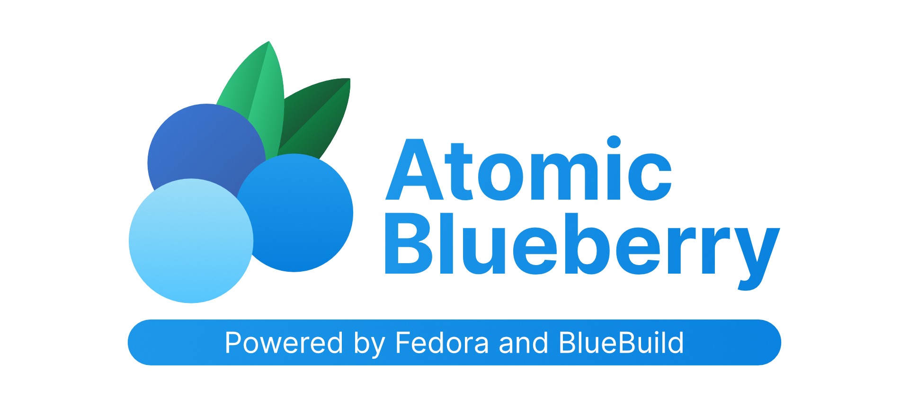

<p align="center">
  
</p>

[](https://github.com/krosseye/atomic-blueberry/actions/workflows/build.yml)

## About

 Atomic Blueberry is an OCI image that is optimized for both battlestations and workstations, built from 'ublue-os/kinoite-main' using Fedora Atomic technology.

## Installation Options

### Rebase

> [!WARNING]  
> **[This is an experimental feature](https://www.fedoraproject.org/wiki/Changes/OstreeNativeContainerStable), try at your own discretion.**

To rebase an existing atomic Fedora installation to the latest build of Atomic Blueberry:

- First rebase to the unsigned image, to get the proper signing keys and policies installed:

  ```bash
  rpm-ostree rebase ostree-unverified-registry:ghcr.io/krosseye/atomic-blueberry:latest
  ```

- Reboot to complete the rebase:

  ```bash
  systemctl reboot
  ```

- Then rebase to the signed image, like so:

  ```bash
  rpm-ostree rebase ostree-image-signed:docker://ghcr.io/krosseye/atomic-blueberry:latest
  ```

- Reboot again to complete the installation

  ```bash
  systemctl reboot
  ```

> [!IMPORTANT]  
The `latest` tag will automatically point to the latest build.

### ISO

> [!IMPORTANT]  
> **Pre-built ISOs are currently not available, this is planned for the future.**

If built on Fedora Atomic, you can generate an offline ISO with the instructions available [here](https://blue-build.org/learn/universal-blue/#fresh-install-from-an-iso).

## Verification

These images are signed with [Sigstore](https://www.sigstore.dev/)'s [cosign](https://github.com/sigstore/cosign). You can verify the signature by downloading the `cosign.pub` file from this repo and running the following command:

```bash
cosign verify --key cosign.pub ghcr.io/krosseye/atomic-blueberry
```
